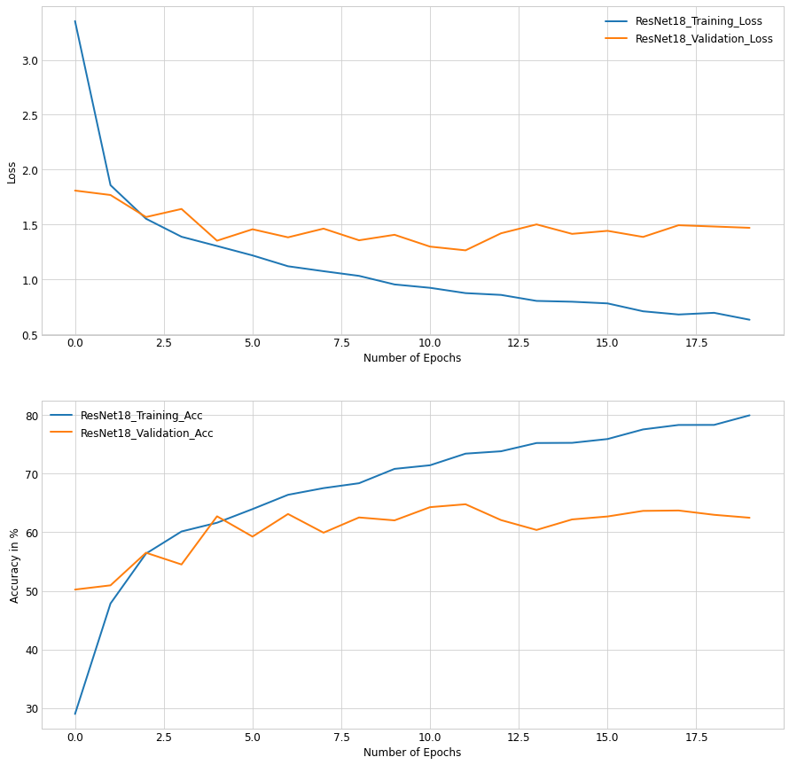
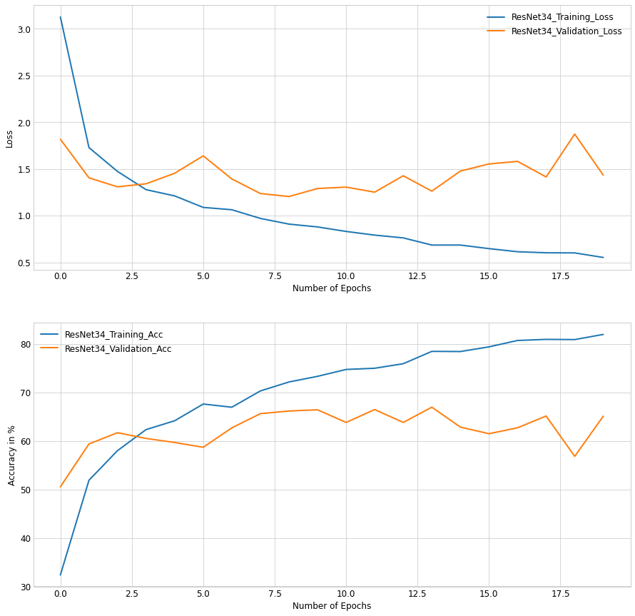

# Fine-Grained-Image-Classifiaction-With-Transfer-Learning
## Introduction
**Transfer Learning** is a **buzzword** in the Deep Learning Community most researchers rely on it for **better** and **faster** results as ***compared to training from scratch***, through this repository I plan to explore Transfer Learning and make a comparision with Training From Scratch.

For this I plan to use *image dataset* of **120 different dog breeds**. The Dataset can be Found on https://www.kaggle.com/c/dog-breed-identification/data.

A **random guess** on a dog breed would yeild us (100/120)% = **0.83%** *Accuracy* and Always Predicting the **Most Frequent** dog breed gives us roughly **1.2%** *Accuracy*.

**Overfitting** is almost always **guaranteed** due to ***poor quailty and less data*** so I have ***used Data Augmentation Techniques*** to decrease the overfitting.
## LeNet-5 From Scratch v/s ResNet-18 and ResNet-34 with Transfer Learning Comparision

### LeNet-5 From Scratch
- We notice that even a **simple network** like *LeNet-5* Starts to **overfit** the data due to **lack of training data**.
- Due to **Simplicity** of the **LeNet** network it **couldn't fit** the **training data** well and due to **lack of data** there is a significant gap between training and validation loss. This is a ***classic example of the High Bias and High Variance*** case.
- Nevertheless It has **validation accuracy** peak of **4.46%** and far is still better than Random Guess and always predicting most frequent.

### ResNet-18 with Transfer Learning
- We notice that *due to the pretrained weights ResNet-18 starts out with a much less loss as compared to LeNet-5 from scratch*, those **pretrainied weights** have indeed **stored** the general of the **features of images**.
- After a few epochs, It the **model** starts to **overfit** the training data. The Plausible reason for that is the **lack of good quality data**, we can implement a few techniques to decrease the overfit. It is a case of **Low Bias and High Variance**.
- It has **validation accuracy** peak of **64.78%** and is ***far far better than LeNet-5*** from Scratch, Random Guess and always predicting most frequent.

### ResNet-34 with Transfer Learning
- We notice that *due to the pretrained weights ResNet-34 starts out with a much less loss as compared to LeNet-5 from scratch*, those **pretrainied weights** have indeed **stored** the general of the **features of images**.
- After a few epochs, It the **model** starts to **overfit** the training data. The Plausible reason for that is the **lack of good quality data**, we can implement a few techniques to decrease the overfit. It is a case of **Low Bias and High Variance**.
- It has **validation accuracy** peak of **66.99%** and quite a bit ***better than ResNet-18*** is ***far far better than LeNet-5*** from Scratch, Random Guess and always predicting most frequent.

## Inferences

1. When *Data is devoid of either quantity or quality or both* **Transfer Learning** strongly **outperforms** any other model which is **training from scratch**, even the simplistic models training from scratch tend to overfit due to lack of data.
2. Techniques like **Data Augmentation** helps the machine learning model **generalize better** hence **decreasing** the amount of **overfitting**.
3. **ResNet** architecture **doesn't perform** the **general trend** that *deeper models tend to overfit more and generalize bad on the validation set and test set*. This is due to the **batch normalization** layers which ***prevents gradients from vanishing or exploding***, the **Residual Connections** helps **gradients flow properly** so that the network can learn both simple and complex mappings from data to labels.
4. **Validaton accuracy and validaton loss** are much **better** than **training accuracy and training loss** at the **initial** 1 or 2 **epochs** and the reason for that is because **training loss** for an epoch is **calculated** and updated right **after one mini-batch** has updated the weights of the model(refer the fuction train in the notebook for better analysis) wheras the **validation loss** is **calculated after the complete epoch**.
5. **Ensembling** both the ResNet models will help **decrease** the **overfitting** and help the machine learning model **generalize better**.

## Scope For Improvement
1. To **decrease** the **overfitting** we can use various techniques like ***L1/L2 regularization, Dropout Regularization and Static Drop Connect Regularization*** for the final fully connected layers.
2. Use of **Differential Learning Rates** for the **different layers** can prove to be **better than freezing the layers**.
3. Using **other pre-trained architectures** like **Inception, Densenets, VGGs** and **Ensembling** them together can definitely help **improve** the model **performance**.

Note: This ***repository is under active development***, I plan to keep improving this by using various methods listed above.
