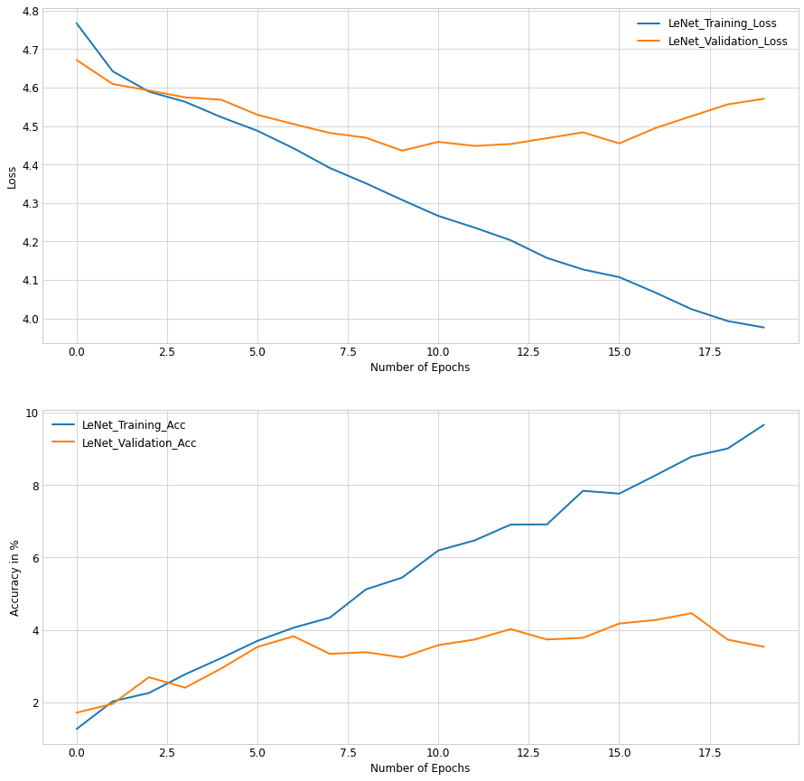

# Fine-Grained-Image-Classifiaction-With-Transfer-Learning
### Objective
Transfer Learning is a buzzword in the Deep Learning Community most researchers rely on it for better and faster results as compared to training from scratch, through this repository I plan to explore Transfer Learning and make a comparision with Training From Scratch.
For this I plan to use image dataset of 120 different dog breeds. The Dataset can be Found on https://www.kaggle.com/c/dog-breed-identification/data.
A random guess on a dog breed would yeild us (100/120)% = 0.83% Accuracy and Always Predicting the Most Frequent dog breed gives us roughly 1.2% Accuracy.  
### LeNet-5 From Scratch v/s ResNet-18 and ResNet-34 with Transfer Learning Comparision

#### LeNet-5 From Scratch
We notice that even a simple network like LeNet-5 Starts to overfit the data due to lack of training data.
Due to Simplicity of the LeNet network it couldn't fit the training data well and due to lack of data there is a significant gap between training and validation loss.
This is a classic example of the High Bias and High Variance case.
Nevertheless It has an accuracy peak of 5% and far is still better than Random Guess and always predicting most frequent.

#### ResNet-18 with Transfer Learning
We notice that due to the pretrained weights ResNet-18 starts out with a much less loss as compared to LeNet-5 from scratch.
Nevertheless It has an accuracy peak of 5% and far is still better than Random Guess and always predicting most frequent.

#### ResNet-34 with Transfer Learning
We notice that due to the pretrained weights ResNet-18 starts out with a much less loss as compared to LeNet-5 from scratch.
Nevertheless It has an accuracy peak of 5% and far is still better than Random Guess and always predicting most frequent.

